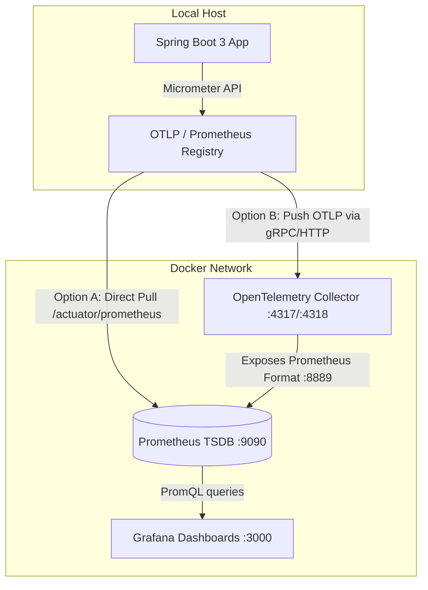
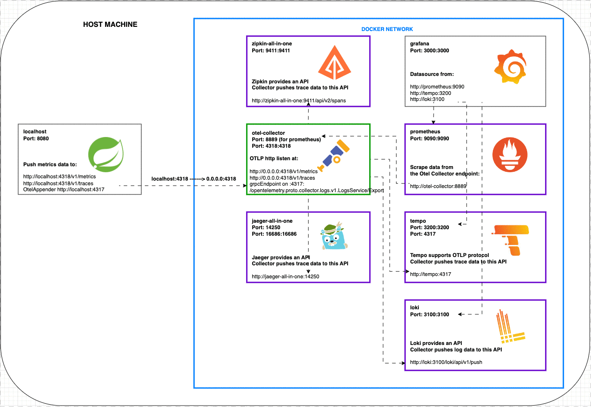

# micrometer-hello-service-2023

# 🚀 Spring Boot 3 Observability Playground

A comprehensive, production-ready hands-on laboratory to explore and master modern enterprise observability. This project demonstrates how **Spring Boot 3 Actuator**, **Micrometer**, **OpenTelemetry (OTel) Collector**, **Prometheus**, and **Grafana** work seamlessly together to collect, transform, and visualize system metrics.

---

## 🧠 Core Architecture & Telemetry Flow

This playground supports two telemetry ingestion architectures: direct scraping and the advanced OpenTelemetry pipeline.



### 1. Spring Boot 3 Actuator
Exposes production-ready system endpoints (such as `/actuator/health` or `/actuator/prometheus`). It acts as the infrastructure host for instrumentation data.

### 2. Micrometer
The **SLF4J for metrics**. Your application code interacts exclusively with Micrometer's abstract API (e.g., `MeterRegistry`, `Counter`). At runtime, Micrometer translates these metrics into vendor-specific formats without touching your business logic.

### 3. OpenTelemetry (OTel) Collector
A high-performance, proxy proxy components that acts as a universal telemetry pipeline. It **receives** OTLP metric streams from Spring Boot, **processes** them (batching, filtering), and **exports** them into Prometheus-compatible formats.

---

## 🛠️ Infrastructure & Configuration Files

All components are fully orchestrated via Docker Compose. Below are the definitive configuration setups used in this project:

### 1. Application Settings (`src/main/resources/application.properties`)
```properties
management.endpoints.web.exposure.include=health,prometheus
management.endpoint.health.show-details=always
management.metrics.tags.application=hello-service-app
```

### 2. OTel Collector Configuration (`./docker/otel-collector/otel-collector-config.yaml`)
```yaml
receivers:
  otlp:
    protocols:
      grpc:
        endpoint: 0.0.0.0:4317
      http:
        endpoint: 0.0.0.0:4318

processors:
  batch:

exporters:
  prometheus:
    endpoint: "0.0.0.0:8889"
    namespace: "otel"

service:
  pipelines:
    metrics:
      receivers: [otlp]
      processors: [batch]
      exporters: [prometheus]
```

### 3. Prometheus Rules (`./docker/prometheus/prometheus.yml`)
```yaml
global:
  scrape_interval: 10s
  evaluation_interval: 10s

scrape_configs:
  # Route A: Direct Application Scraping (Uses host.docker.internal to bridge container-to-host)
  - job_name: 'hello-service-direct'
    metrics_path: /actuator/prometheus
    static_configs:
      - targets: ['host.docker.internal:8080']

  # Route B: OpenTelemetry Pipeline Scraping
  - job_name: 'otel-collector-metrics'
    static_configs:
      - targets: ['otel-collector:8889']
```

### 4. Core Orchestration (`docker-compose.yml`)
```yaml
version: '3.8'

services:
  prometheus:
    container_name: prometheus
    image: prom/prometheus:latest
    restart: always
    extra_hosts:
      - "host.docker.internal:host-gateway" # Enables cross-network communication on Linux/Win/macOS
    command:
      - '--config.file=/etc/prometheus/prometheus.yml'
    volumes:
      - ./docker/prometheus/prometheus.yml:/etc/prometheus/prometheus.yml
    ports:
      - "9090:9090"

  otel-collector:
    container_name: otel-collector
    image: otel/opentelemetry-collector-contrib:latest
    restart: always
    command: ["--config=/etc/otel-collector-config.yaml"]
    volumes:
      - ./docker/otel-collector/otel-collector-config.yaml:/etc/otel-collector-config.yaml
    ports:
      - "4317:4317" # OTLP gRPC receiver
      - "4318:4318" # OTLP HTTP receiver
      - "8889:8889" # Prometheus exporter endpoint

  grafana:
    container_name: grafana
    image: grafana/grafana:latest
    restart: always
    ports:
      - "3000:3000"
```

---

## 🚀 Getting Started

### Prerequisites
* Java 17+ & Maven
* Docker and Docker Compose

### Step 1: Fire up the Observability Stack
Run the following command to deploy Prometheus, Grafana, and the OTel Collector in the background:
```bash
docker compose up -d
```

### Step 2: Run your Spring Boot Application
Launch your application locally on port `8080`. Validate that the endpoint is active:
```bash
curl http://localhost:8080/actuator/prometheus
```

### Step 3: Access the Diagnostic UIs
* **Prometheus Targets Status:** `http://localhost:9090/targets` (Verify `hello-service-direct` is `UP`).
* **Grafana Dashboard:** `http://localhost:3000` (Default credentials: `admin` / `admin`).

---

## 🕹️ Playground Exercises & PromQL Manual

Once your metrics are flowing, test your knowledge using the following tasks:

### Exercise 1: Run Essential PromQL Queries
Go to the **Prometheus Web UI (9090)** and try these core infrastructure queries:

* **JVM Heap Memory Usage Percentage:**
  ```promql
  jvm_memory_used_bytes{area="heap"} / jvm_memory_max_bytes{area="heap"} * 100
  ```
* **HTTP Server Request Rate (5-minute window):**
  ```promql
  rate(http_server_requests_seconds_count[5m])
  ```
* **95th Percentile Latency for Application Endpoints:**
  ```promql
  histogram_quantile(0.95, sum(rate(http_server_requests_seconds_bucket[5m])) by (le))
  ```

### Exercise 2: Connect Prometheus to Grafana
1. Open Grafana and go to **Connections > Data Sources > Add data source**.
2. Select **Prometheus**.
3. Set the URL connection string to: `http://prometheus:9090`.
4. Click **Save & Test**.

### Exercise 3: Import a Ready-To-Use Dashboard
To avoid building panels from scratch, import a pre-configured JVM layout:
1. In Grafana, go to Dashboards -> Click **New** -> **Import**.
2. Type Community ID: **`4701`** and hit **Load**.
3. Select your Prometheus data source from the dropdown menu and click **Import**.
4. Enjoy real-time insights into system CPU, GC pauses, memory allocations, and HTTP traffic.

---



## 📝 License
This project is open-source and available under the [MIT License](LICENSE).